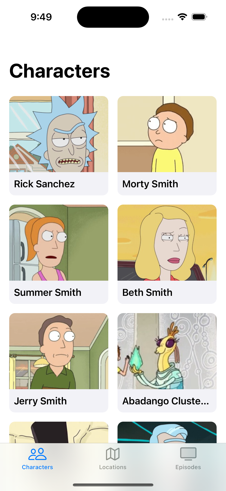
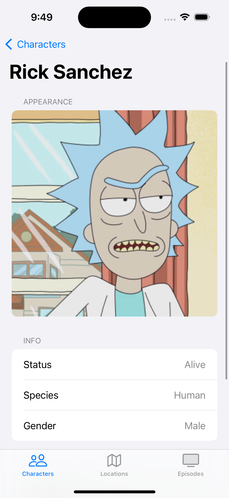
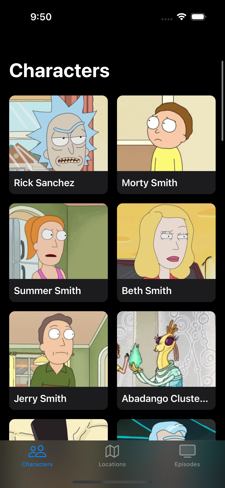
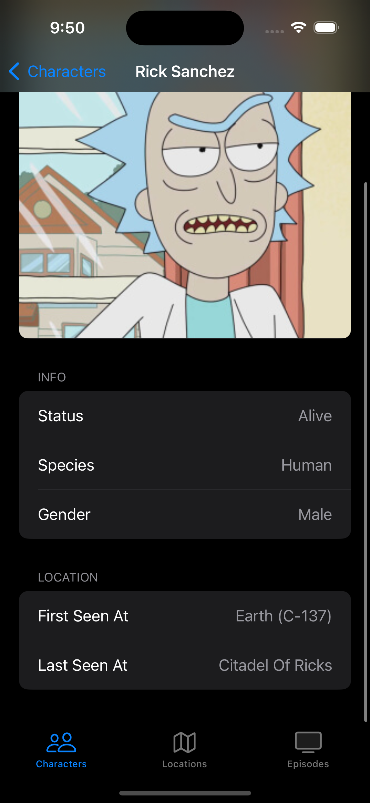

# Rick And Morty iOS App

- This app is a Work In Progress
- It utilizes [The Rick and Morty API](https://rickandmortyapi.com)

## Project Specifications
- Developed on Xcode 15.2
- Minimum deployment target: iOS 17.0
  
## Project Details
- Programmatic UI
- UIKit
- Combine for networking and data binding
- MVVM
- Clean architecture separating data, domain and presentation layers
- Repository pattern, dependency injection
- Image caching using NSCache
- Coordinators for navigation
- Compositional layout and diffable datasource
- Supports light and dark mode

## Screenshots
  
 

## Getting Started
- Clone this repository
- Open `RickAndMorty.xcodeproj`

## TODOs
- Implement locations with listing and detail screens
- Implement episodes with listing and detail screens
- Implement search and filter features for characters, locations, and episodes listing screens
- Add unit tests
